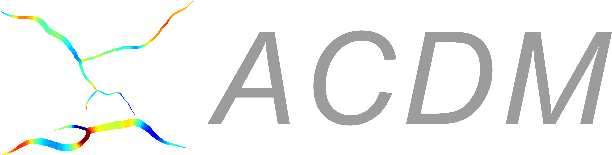
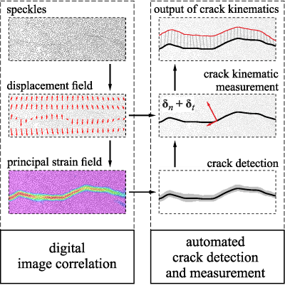
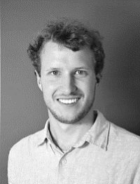
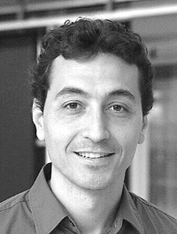

  

ACDM (Automated crack detection and measurement) is an open-source software for the automated measurement of cracks in experiments instrumented with digital image correlation (DIC).  

## Description

The software is used for the automatic detection of crack locations and the measurement crack kinematics (crack width and slips).

The input data are DIC results of multiple measuring stages generated with the commercial software [VIC-3D](https://www.correlatedsolutions.com/vic-3d/) or [VIC-2D](https://www.correlatedsolutions.com/vic-2d/) from Correlated Solution®. Data from other DIC software must be converted to the VIC output format (see [test data](https://gitlab.ethz.ch/ibk-kfm-public/acdm/-/tree/master/test/)). We provide converters to DIC data generated with [NCORR](https://gitlab.ethz.ch/ibk-kfm-public/ncorr-to-vic-2d-converter) (free) and [GOM Correlate](https://gitlab.ethz.ch/ibk-kfm-public/gom-to-vic-3d-converter) (commercial).

**Please cite the following works when using this software:**  
[N. Gehri, J. Mata-Falcón, W. Kaufmann, **Automated crack detection and measurement based on digital image correlation**, Construction and Building Materials, 256 (2020), Article 119383, doi:10.1016/j.conbuildmat.2020.119383](https://doi.org/10.1016/j.conbuildmat.2020.119383)  
[N. Gehri, J. Mata-Falcón, W. Kaufmann, **Refined Extraction of Crack Characteristics in Large-scale Concrete Experiments based on Digital Image Correlation**, Engineering Structures, 251 (2022), Article 113486, doi.org/10.1016/j.engstruct.2021.113486](https://doi.org/10.1016/j.engstruct.2021.113486)
  

## Installation
ACDM is installed following the steps in [wiki/Setup-Guide](https://gitlab.ethz.ch/ibk-kfm-public/acdm/-/wikis/Setup-Guide).

## Usage
Instructions and guidelines for the usage of ACDM are provided in [wiki/Technical-document](https://gitlab.ethz.ch/ibk-kfm-public/acdm/-/wikis/Technical-Documentation).

## Roadmap
The software is currently under further development at the [Chair of Structural Engineering - Concrete Structures and Bridge Design, ETH Zürich](https://kaufmann.ibk.ethz.ch/).

## Contributing
If you encounter a bug in ACDM or think ACDM can be improved by adding a particular feature, please let us know about it via the Gitlab [Issue](https://gitlab.ethz.ch/ibk-kfm-public/acdm/-/issues) tool. For bug reporting, please send a short description of the problem along with any project or image files you think may help us to reproduce the bug.

## Authors
The software is developed by [Nicola Gehri](https://kaufmann.ibk.ethz.ch/people/staff/nicola-gehri.html), [Dr. Jaime Mata-Falcón](https://kaufmann.ibk.ethz.ch/people/staff/dr-jaime-mata-falcon.html) and [Prof. Dr. Walter Kaufmann](https://kaufmann.ibk.ethz.ch/people/professor.html) at the [Chair of Structural Engineering - Concrete Structures and Bridge Design, ETH Zürich](https://kaufmann.ibk.ethz.ch/)

|   |  |  |
|----------|----------|----------|
| [Nicola Gehri](https://kaufmann.ibk.ethz.ch/people/staff/nicola-gehri.html) | [Dr. Jaime Mata-Falcón](https://kaufmann.ibk.ethz.ch/people/staff/dr-jaime-mata-falcon.html) | [Prof. Dr. Walter Kaufmann](https://kaufmann.ibk.ethz.ch/people/professor.html) |

 

## Copyright and license
ACDM is copyright, 2020, ETH Zurich, Switzerland. 
The software is licensed under the [Apache License, Version 2.0](http://www.apache.org/licenses/LICENSE-2.0) (the "License")
